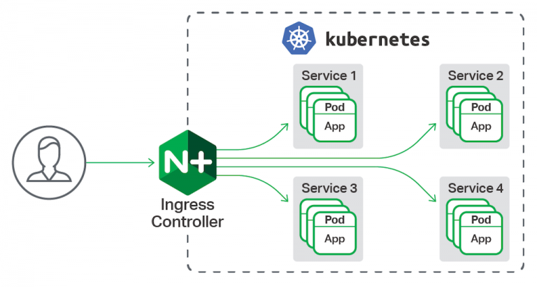
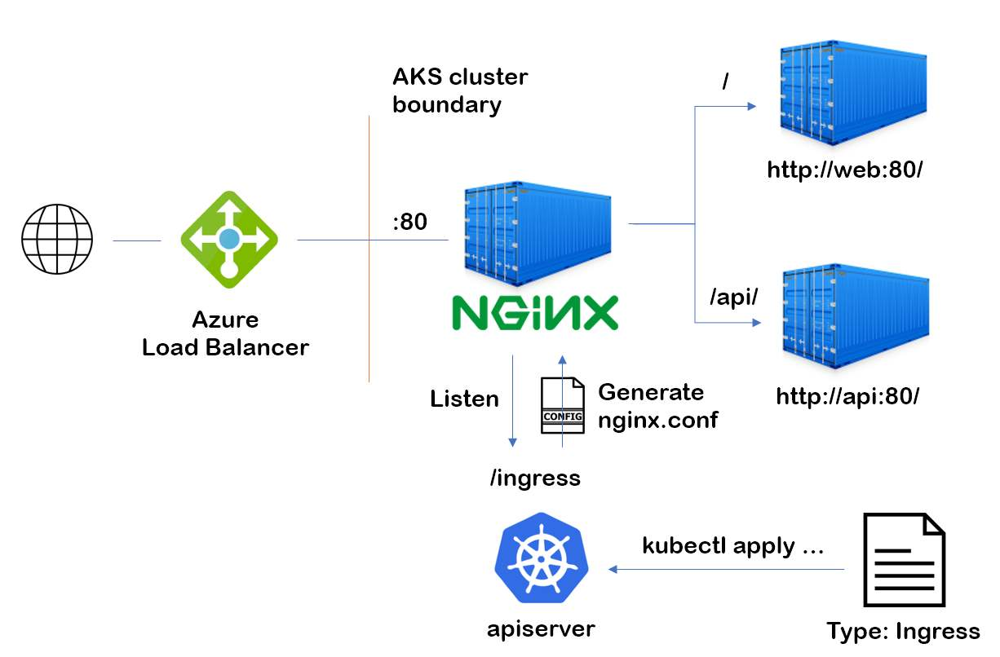

# Application Gateway Ingress Controller

## Overview

If you want more info related to this Controller review <https://github.com/patocl/application-gateway-kubernetes-ingress>

if you want investigate what is Ingress Controller <https://kubernetes.github.io/ingress-nginx>

## How to install

If you want detailed documentation please review too <https://azure.github.io/application-gateway-kubernetes-ingress>

## Videos related

I want to comment some interesting videos related to How to configure, What is, and etc.





## Structure of ingress file

This is a minimal definition of ingress controller file, write on YAML too

``` yaml
apiVersion: networking.k8s.io/v1beta1
kind: Ingress
metadata:
  name: test-ingress
  annotations:
    nginx.ingress.kubernetes.io/rewrite-target: /
spec:
  rules:
  - http:
      paths:
      - path: /testpath
        backend:
          serviceName: test
          servicePort: 80
```

Another example

``` yaml
apiVersion: networking.k8s.io/v1beta1
kind: Ingress
metadata:
  name: name-virtual-host-ingress
spec:
  rules:
  - host: foo.bar.com
    http:
      paths:
      - backend:
          serviceName: service1
          servicePort: 80
  - host: bar.foo.com
    http:
      paths:
      - backend:
          serviceName: service2
          servicePort: 80
```

if you want to know more about sintaxis or capabilities than u can configure please visit <https://kubernetes.io/docs/concepts/services-networking/ingress/>
