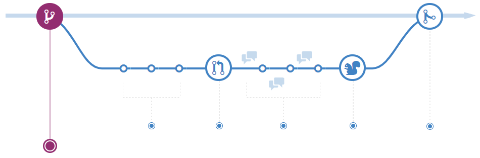
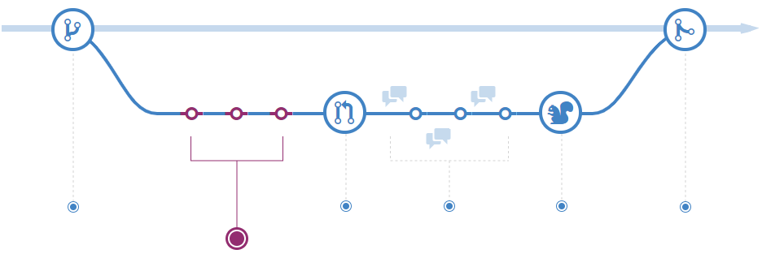
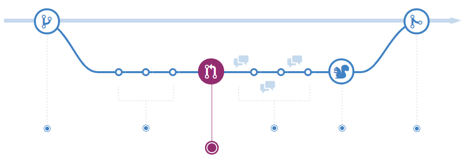
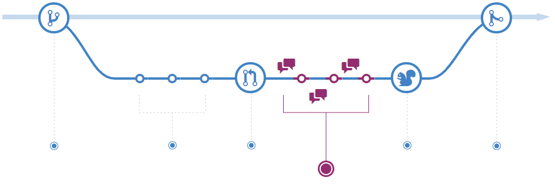
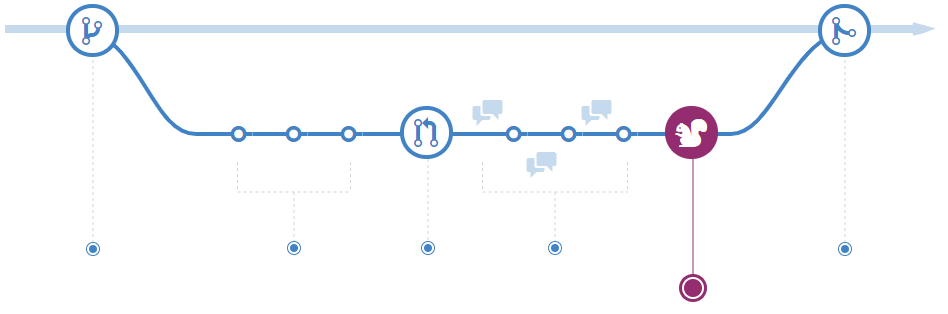
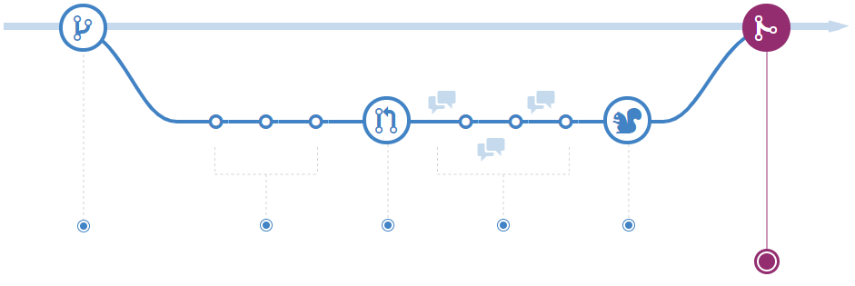

# Branching Workflow Types

The core idea behind the Feature Branch Workflow is that all feature development should take place in a dedicated branch instead of the master branch. This encapsulation makes it easy for multiple developers to work on a particular feature without disturbing the main codebase. It also means the master branch will never contain broken code, which is a huge advantage for continuous integration environments.

Encapsulating feature development also makes it possible to leverage pull requests, which are a way to initiate discussions around a branch. They give other developers the opportunity to sign off on a feature before it gets integrated into the official project. Or, if you get stuck in the middle of a feature, you can open a pull request asking for suggestions from your colleagues. The point is, pull requests make it incredibly easy for your team to comment on each other’s work.

In addition, feature branches can (and should) be pushed to the central repository. This makes it possible to share a feature with other developers without touching any official code. Since master is the only “special” branch, storing several feature branches on the central repository doesn’t pose any problems. Of course, this is also a convenient way to back up everybody’s local commits.

## How it works

The Feature Branch Workflow assumes a central repository, and master represents the official project history. Instead of committing directly on their local master branch, developers create a new branch every time they start work on a new feature. Feature branches should have descriptive names, like new-banner-images or bug-91. The idea is to give a clear, highly-focused purpose to each branch. Git makes no technical distinction between the master branch and feature branches, so developers can edit, stage, and commit changes to a feature branch.

## Create a branch

When you're working on a project, you're going to have a bunch of different features or ideas in progress at any given time – some of which are ready to go, and others which are not. Branching exists to help you manage this workflow.

When you create a branch in your project, you're creating an environment where you can try out new ideas. Changes you make on a branch don't affect the master branch, so you're free to experiment and commit changes, safe in the knowledge that your branch won't be merged until it's ready to be reviewed by someone you're collaborating with.

Branching is a core concept in Git, and the entire branch flow is based upon it. There's only one rule: anything in the master branch is always deployable.

Because of this, it's extremely important that your new branch is created off of master when working on a feature or a fix. Your branch name should be descriptive (e.g., refactor-authentication, user-content-cache-key, make-retina-avatars), so that others can see what is being worked on.

## Add commits

Once your branch has been created, it's time to start making changes. Whenever you add, edit, or delete a file, you're making a commit, and adding them to your branch. This process of adding commits keeps track of your progress as you work on a feature branch.

Commits also create a transparent history of your work that others can follow to understand what you've done and why. Each commit has an associated commit message, which is a description explaining why a particular change was made. Furthermore, each commit is considered a separate unit of change. This lets you roll back changes if a bug is found, or if you decide to head in a different direction.

Commit messages are important, especially since Git tracks your changes and then displays them as commits once they're pushed to the server. By writing clear commit messages, you can make it easier for other people to follow along and provide feedback.

## Open a Pull Request

Pull Requests initiate discussion about your commits. Because they're tightly integrated with the underlying Git repository, anyone can see exactly what changes would be merged if they accept your request.

You can open a Pull Request at any point during the development process: when you have little or no code but want to share some screenshots or general ideas, when you're stuck and need help or advice, or when you're ready for someone to review your work. By using @mention system in your Pull Request message, you can ask for feedback from specific people or teams, whether they're down the hall or ten time zones away.

Pull Requests are useful for contributing to projects and for managing changes to shared repositories. If you're using a Fork & Pull Model, Pull Requests provide a way to notify project maintainers about the changes you'd like them to consider. If you're using a Shared Repository Model, Pull Requests help start code review and conversation about proposed changes before they're merged into the master branch.

## Discuss and review your code

Once a Pull Request has been opened, the person or team reviewing your changes may have questions or comments. Perhaps the coding style doesn't match project guidelines, the change is missing unit tests, or maybe everything looks great and props are in order. Pull Requests are designed to encourage and capture this type of conversation.

You can also continue to push to your branch in light of discussion and feedback about your commits. If someone comments that you forgot to do something or if there is a bug in the code, you can fix it in your branch and push up the change. Git will show your new commits and any additional feedback you may receive in the unified Pull Request view.

Pull Request comments are written in Markdown, so you can embed images and emoji, use pre-formatted text blocks, and other lightweight formatting.

## Deploy

With Git, you can deploy from a branch for final testing in an environment before merging to master.

Once your pull request has been reviewed and the branch passes your tests, you can deploy your changes to verify them . If your branch causes issues, you can roll it back by deploying the existing master.

## Merge

Now that your changes have been verified, it is time to merge your code into the master branch.

Once merged, Pull Requests preserve a record of the historical changes to your code. Because they're searchable, they let anyone go back in time to understand why and how a decision was made.

By incorporating certain keywords into the text of your Pull Request, you can associate issues with code. When your Pull Request is merged, the related issues can also closed.

This workflow helps organize and track branches that are focused on business domain feature sets. Other Git workflows like the Git Forking Workflow and the Gitflow Workflow are repo focused and can leverage the Git Feature Branch Workflow to manage their branching models.

## Watch this video

If you are interested in this topic, please review those videos

* GitFlow Improving the Flow of Code <https://youtu.be/T7QYscQZwAM>
* Implementing Gitflow <https://youtu.be/v3yQcjMYSfI>
