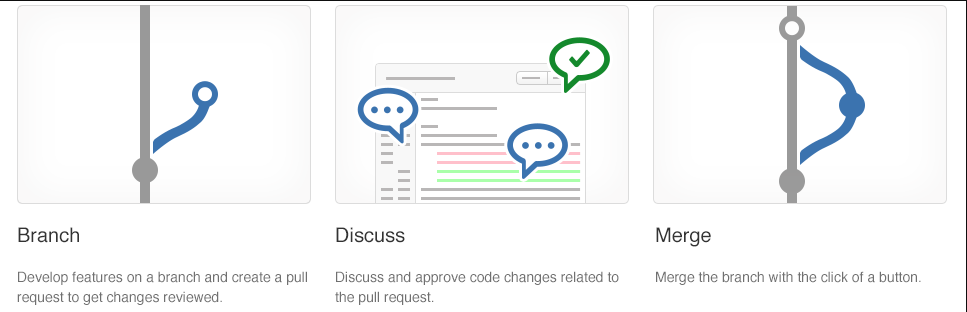

# Collaborating with Pull Requests

Pull requests let you tell others about changes you've pushed to a GitHub repository. Once a pull request is sent, interested parties can review the set of changes, discuss potential modifications, and even push follow-up commits if necessary.

Pull Requests are commonly used by teams and organizations collaborating using the Shared Repository Model, where everyone shares a single repository and topic branches are used to develop features and isolate changes. Many open source projects on Github use pull requests to manage changes from contributors as they are useful in providing a way to notify project maintainers about changes one has made and in initiating code review and general discussion about a set of changes before being merged into the main branch.

Pull requests combine the review and merge of your code into a single collaborative process. Once you’re done fixing a bug or new feature in a branch, create a new pull request. Add the members of the team to the pull request so they can review and vote on your changes. Use pull requests to review works in progress and get early feedback on changes. There’s no commitment to merge the changes as the owner can abandon the pull request at any time.

## Get your code reviewed

The code review done in a pull request isn’t just to find obvious bugs—that’s what your tests are for. A good code review catches less obvious problems that could lead to costly issues later. Code reviews help protect your team from bad merges and broken builds that sap your team’s productivity. The review catches these problems before the merge, protecting your important branches from unwanted changes.

Cross-pollinate expertise and spread problem solving strategies by using a wide range of reviewers in your code reviews. Diffusing skills and knowledge makes your team stronger and more resilient.

## Give great feedback

High quality reviews start with high quality feedback. The keys to great feedback in a pull request are:

* Have the right people review the pull request
* Make sure that reviewers know what the code does
* Give actionable, constructive feedback
* Reply to comments in a timely manner

When assigning reviewers to your pull request, make sure you select the right set of reviewers. You want reviewers that will know how your code works, but try to also include developers working in other areas so they can share their ideas. Provide a clear description of your changes and provide a build of your code that has your fix or feature running in it. Reviewers should make an effort to provide feedback on changes they don’t agree with. Identify the the issue and give a specific suggestions on what you would do differently. This feedback has clear intent and is easy for the owner of the pull request to understand. The pull request owner should reply to the comments, accepting the suggestion or explaining why the suggested change isn’t ideal. Sometimes a suggestion is good, but the changes are outside the scope of the pull request. Take these suggestions and create new work items and feature branches separate from the pull request to make those changes.

## Protect branches with policies

There are a few critical branches in your repo that the team relies on always being in good shape, such as your master branch. Require pull requests to make any changes on these branches. Developers pushing changes directly to the protected branches will have their pushes rejected.

Add additional conditions to your pull requests to enforce a higher level of code quality in your key branches. A clean build of the merged code and approval from multiple reviewers are some extra requirements you can set to protect your key branches.
